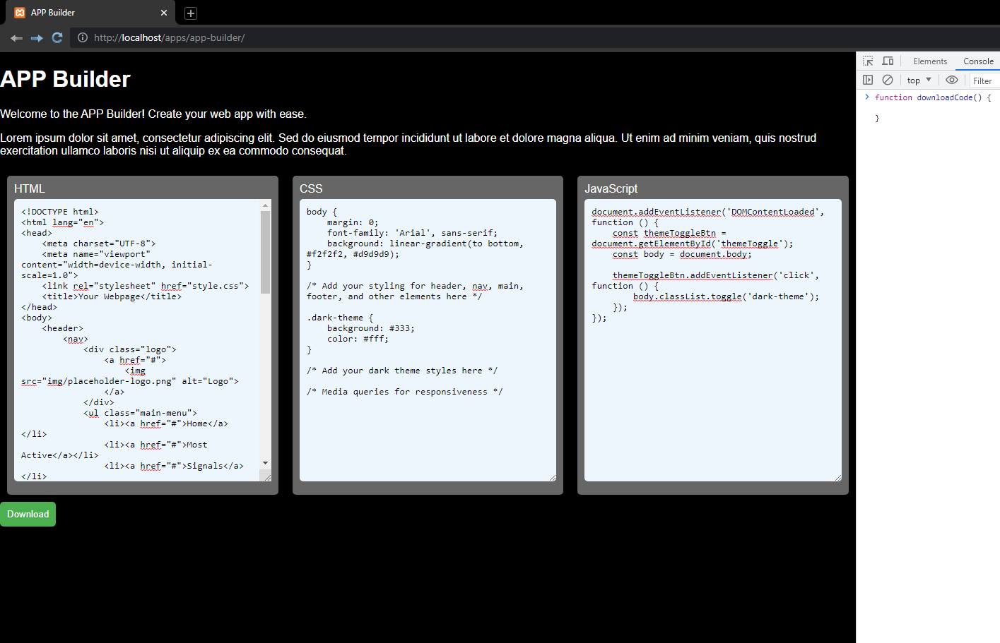

# App-Builder-GPT

Use this app to generate the codes you get from ChatGPT.
Just paste in the html from chatGPT and click download to get a ZIP of all those codes.

For now, I'm using a web-based because I have xampp on this machine.
But we can build it to handle different backend later.

# Go ahead, add features and Pull request if you want

You can also use the Issues tab, to suggest some features.

# Cheers!
